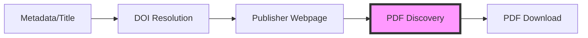

# Scholar Module Workflow Design

## User's Vision
> "we can handle part of metadata (like title) → DOI → webpage → pdf discovery → download"

## Complete Workflow Pipeline



### Step 1: Metadata → DOI
**Input**: Partial metadata (title, authors, year)
**Process**: 
- Search CrossRef API
- Search PubMed
- Search Google Scholar
**Output**: DOI

```python
# Already implemented in _DOIResolver.py
doi = await resolver.resolve_from_metadata({
    'title': 'Highly accurate protein structure prediction',
    'authors': ['Jumper', 'Evans'],
    'year': 2021
})
# Returns: "10.1038/s41586-021-03819-2"
```

### Step 2: DOI → Webpage
**Input**: DOI
**Process**: Follow DOI redirect
**Output**: Publisher URL

```python
# Simple redirect following
doi_url = f"https://doi.org/{doi}"
# Redirects to: https://www.nature.com/articles/s41586-021-03819-2
```

### Step 3: Webpage → PDF Discovery (Using Zotero Translators)
**Input**: Publisher webpage URL
**Process**: Use Zotero translator patterns for PDF discovery
**Output**: PDF URL(s)

```python
# Using PDFDiscoveryEngine with Zotero patterns
engine = PDFDiscoveryEngine()
pdf_url = await engine.find_best_pdf(page, publisher_url)
# Returns: "https://www.nature.com/articles/s41586-021-03819-2.pdf"
```

### Step 4: PDF Download
**Input**: PDF URL + Authentication cookies
**Process**: Download with OpenAthens session
**Output**: PDF file

```python
# Using authenticated session
pdf_content = await downloader.download_pdf(pdf_url)
```

## Why Zotero Translators for PDF Discovery?

1. **Community Maintained**: 675+ translators for different publishers
2. **Publisher-Specific Logic**: Each site has unique PDF patterns
3. **Robust Selectors**: Years of refinement in finding PDFs
4. **Handles Edge Cases**: Supplementary materials, multiple versions

## Implementation Architecture

### 1. Metadata Enrichment Layer
```python
class MetadataEnricher:
    async def enrich(self, partial_metadata):
        # CrossRef API
        # PubMed API
        # Google Scholar
        return enriched_metadata
```

### 2. DOI Resolution Layer
```python
class DOIResolver:
    async def resolve(self, metadata):
        # Multiple search strategies
        # Fuzzy matching
        # Confidence scoring
        return doi
```

### 3. PDF Discovery Layer (Zotero Translators)
```python
class PDFDiscoveryEngine:
    def __init__(self):
        # Load Zotero translator patterns
        # Publisher-specific selectors
        # URL transformation rules
    
    async def discover_pdfs(self, webpage_url):
        # Apply Zotero translator logic
        # Find PDF links
        # Rank by confidence
        return pdf_urls
```

### 4. Download Layer
```python
class PDFDownloader:
    async def download(self, pdf_url, cookies):
        # Use authenticated session
        # Handle redirects
        # Verify PDF content
        return pdf_content
```

## Key Insights

1. **Zotero translators are perfect for step 3** - They excel at finding PDFs on publisher pages
2. **We don't need full Zotero environment** - Just the PDF discovery patterns
3. **OpenAthens handles authentication** - Translators just find URLs
4. **Direct patterns are Zotero-inspired** - We're already using their approach

## Example: Complete Flow

```python
async def get_paper_pdf(title: str):
    # Step 1: Title → DOI
    doi = await doi_resolver.resolve_from_title(title)
    
    # Step 2: DOI → Webpage
    publisher_url = await follow_doi_redirect(doi)
    
    # Step 3: Webpage → PDF URL (Zotero patterns)
    pdf_url = await pdf_discovery.find_best_pdf(publisher_url)
    
    # Step 4: Download PDF
    pdf_content = await pdf_downloader.download(pdf_url)
    
    return pdf_content
```

## Benefits of This Approach

1. **Modular**: Each step can be improved independently
2. **Reliable**: Uses best tool for each job
3. **Fast**: Zotero patterns without full JS execution
4. **Authenticated**: Works with paywalled content

## Current Status

✅ Step 1: DOI Resolution - Implemented
✅ Step 2: DOI → URL - Simple redirect
✅ Step 3: PDF Discovery - Implemented with Zotero patterns
✅ Step 4: PDF Download - Working with OpenAthens

The system now uses Zotero translator patterns specifically for finding PDFs on publisher websites, exactly as you envisioned!