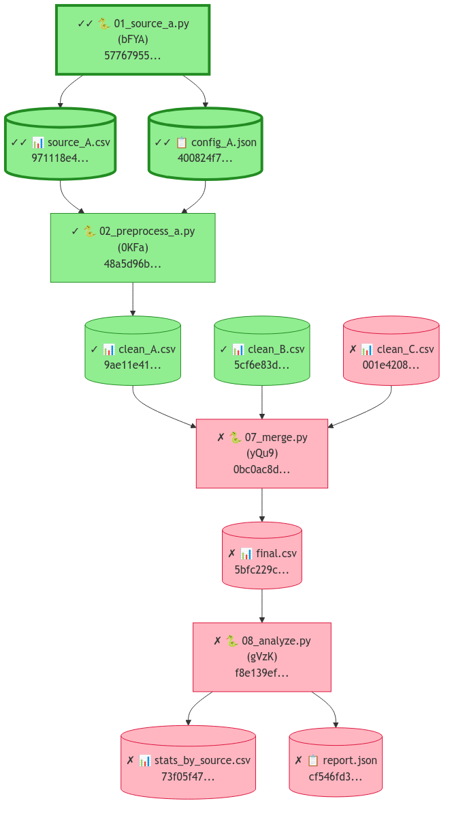

<!-- ---
!-- Timestamp: 2026-02-01 08:53:16
!-- Author: ywatanabe
!-- File: /home/ywatanabe/proj/scitex-python/examples/scitex/verify/README.md
!-- --- -->

# SciTeX Clew Module Examples

This directory demonstrates the **clew module** - hash-based verification for reproducible science.

## DAG Visualization

The verification system tracks dependencies as a Directed Acyclic Graph (DAG):



**Legend:**
- **Green nodes (✓)**: Cache-verified (fast hash comparison)
- **Green nodes (✓✓)**: Rerun-verified (re-executed and confirmed)
- **Red/Pink nodes (✗)**: Failed verification (hash mismatch)
- **Rectangles**: Python scripts
- **Cylinders**: Data files (CSV, JSON, etc.)
- **Hash strings**: Truncated SHA256 fingerprints

## Pipeline Structure

This example implements a multi-branch data processing pipeline:

```
Branch A                Branch B                Branch C
┌──────────────┐        ┌──────────────┐        ┌──────────────┐
│ 01_source_a  │        │ 03_source_b  │        │ 05_source_c  │
│ (config+data)│        │   (data)     │        │   (data)     │
└──────┬───────┘        └──────┬───────┘        └──────┬───────┘
       │                       │                       │
       ▼                       ▼                       ▼
┌──────────────┐        ┌──────────────┐        ┌──────────────┐
│02_preprocess │        │04_preprocess │        │06_preprocess │
│   (clean)    │        │   (clean)    │        │   (clean)    │
└──────┬───────┘        └──────┬───────┘        └──────┬───────┘
       │                       │                       │
       └───────────────────────┼───────────────────────┘
                               │
                               ▼
                        ┌──────────────┐
                        │  07_merge    │
                        │ (combine all)│
                        └──────┬───────┘
                               │
                               ▼
                        ┌──────────────┐
                        │  08_analyze  │
                        │  (report)    │
                        └──────────────┘
```

## Quick Start

```bash
# Run the complete pipeline
./00_run_all.sh

# Run with clean start
./00_run_all.sh --clean

# Individual scripts
python 01_source_a.py --n_samples=200
python 07_merge.py --input_a=custom_path.csv
```

## Scripts

| Script | Description | Inputs | Outputs |
|--------|-------------|--------|---------|
| `01_source_a.py` | Generate source A with config | - | `source_A.csv`, `config_A.json` |
| `02_preprocess_a.py` | Clean and filter A | `source_A.csv`, `config_A.json` | `clean_A.csv` |
| `03_source_b.py` | Generate source B | - | `source_B.csv` |
| `04_preprocess_b.py` | Clean and filter B | `source_B.csv` | `clean_B.csv` |
| `05_source_c.py` | Generate source C | - | `source_C.csv` |
| `06_preprocess_c.py` | Clean and filter C | `source_C.csv` | `clean_C.csv` |
| `07_merge.py` | Merge all branches | `clean_A/B/C.csv` | `final.csv` |
| `08_analyze.py` | Final analysis | `final.csv` | `stats_by_source.csv`, `report.json` |
| `09_demo_verification.py` | Demo verification states | - | `dag.html/png/svg` |
| `10_programmatic_verification.py` | API usage examples | - | - |

## Verification States

The clew module tracks three verification states:

### Cache-Verified (✓)
Fast comparison of stored vs current file hashes.
```python
# Automatic via @stx.session + stx.io
@stx.session
def main():
    data = stx.io.load("input.csv")   # Hash recorded
    stx.io.save(result, "output.csv") # Hash recorded
```

### Rerun-Verified (✓✓)
Full re-execution confirms outputs match stored hashes.
```python
from scitex.clew import verify_by_rerun
result = verify_by_rerun("01_source_a_out/source_A.csv")
print("✓✓" if result.is_verified else "✗")
```

### Failed (✗)
Hash mismatch indicates file was modified externally.
```python
# Simulate by modifying a file
import pandas as pd
data = pd.read_csv("clean_C.csv")
data["value"] *= 1.001  # Small modification
data.to_csv("clean_C.csv", index=False)
# Now verification will fail for clean_C.csv and all downstream
```

## Verification CLI

```bash
# List tracked runs
scitex clew list

# Check status (like git status)
scitex clew status

# Verify specific run
scitex clew run SESSION_ID

# Trace file dependencies
scitex clew chain 08_analyze_out/report.json
```

## Programmatic API

```python
from scitex import clew

# Database stats
stats = clew.stats()
print(f"Total runs: {stats['total_runs']}")

# List recent runs
runs = clew.list_runs(limit=10)

# Verify a chain
chain = clew.chain("08_analyze_out/report.json")
print(f"Chain verified: {chain.is_verified}")
print(f"Chain length: {chain.chain_length}")

# Generate DAG visualization
from scitex.clew import render_dag
render_dag("dag.html", target_file="report.json", show_hashes=True)
render_dag("dag.png", target_file="report.json")  # Requires mmdc
```

## DAG Visualization Formats

The `render_dag()` function supports multiple output formats:

| Format | Extension | Requirements | Use Case |
|--------|-----------|--------------|----------|
| HTML | `.html` | None | Interactive browser viewing |
| Mermaid | `.mmd` | None | Embedding in markdown |
| PNG | `.png` | `mmdc` (mermaid-cli) | Documentation, reports |
| SVG | `.svg` | `mmdc` (mermaid-cli) | Scalable graphics |
| JSON | `.json` | None | Programmatic access |

## How Verification Works

1. **Session tracking**: `@stx.session` records script hash, start time, and config
2. **File tracking**: `stx.io.load/save` records file paths and SHA256 hashes
3. **Chain linking**: Input files link to sessions that produced them
4. **Verification**: Compare stored hashes with current file contents

```
Session DB Schema:
┌─────────────────────────────────────────────┐
│ runs: session_id, script_path, script_hash  │
│ files: session_id, path, hash, role(in/out) │
│ verifications: session_id, level, status    │
└─────────────────────────────────────────────┘
```

## Failure Propagation

When a file fails verification, all downstream files are also marked as failed:

```
source_A.csv (✓)  ─┐
                   ├─→ clean_A.csv (✓) ─┐
config_A.json (✓) ─┘                    │
                                        │
source_B.csv (✓) ──→ clean_B.csv (✓) ──┼─→ final.csv (✗) ─→ report.json (✗)
                                        │
source_C.csv (✓) ──→ clean_C.csv (✗) ──┘
                     ↑
                     Modified externally!
```

## See Also

- `src/scitex/verify/README.md` - Module implementation details
- `scitex clew --help` - CLI documentation
- `scitex://module/session` - MCP resource for session tracking

<!-- EOF -->
