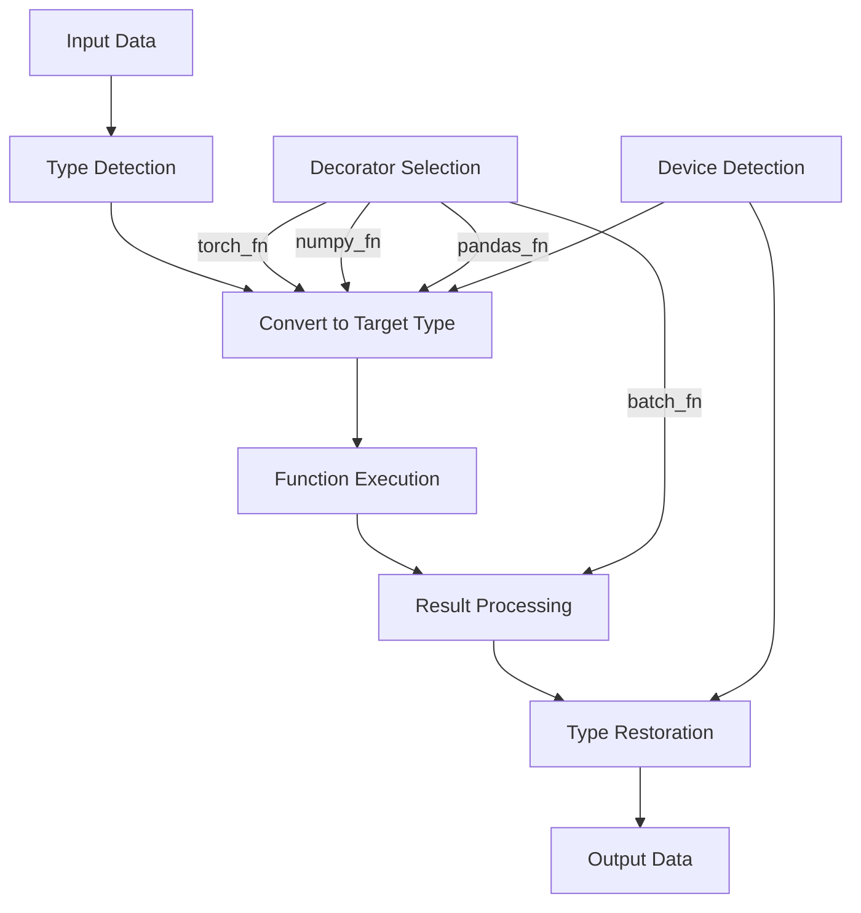

<!-- ---
!-- Timestamp: 2025-04-30 14:45:28
!-- Author: ywatanabe
!-- File: /home/ywatanabe/proj/scitex_repo/src/scitex/decorators/BLUEPRINT.md
!-- --- -->

# Data Type Conversion Decorators Blueprint

## Overview

A comprehensive system for seamless data type conversions between NumPy, PyTorch, Pandas, and other array formats with type preservation and efficient processing.

## Assumptions and Requirements

* Python 3.7+
* NumPy, PyTorch, Pandas, xarray
* Type hints support
* Functional programming paradigm

## Concerns

* [ ] Ensure memory efficiency with large arrays
* [ ] Handle edge cases for nested data structures
* [ ] Maintain type consistency across nested decorator chains
* [ ] Optimize CUDA memory management

## Workflow as Text Diagram

`Input Data → Type Detection → Conversion to Target Type → Function Execution → Result Conversion → Type Restoration → Output Data`

## Workflow as Mermaid



## Directory Structure

```
scitex/decorators/
├── __init__.py
├── _wrap.py
├── _converters.py
├── _torch_fn.py
├── _numpy_fn.py
├── _pandas_fn.py
├── _batch_fn.py
├── _timeout.py
├── _deprecated.py
├── _preserve_doc.py
├── _not_implemented.py
├── _cache_mem.py
├── _cache_disk.py
└── _DataTypeDecorators.py
```

## Modules and Roles

| Module                 | Role               | Functions                                         |
|------------------------|--------------------|---------------------------------------------------|
| _wrap.py               | Base decorator     | wrap() - Preserves function metadata              |
| _converters.py         | Core conversion    | to_torch(), to_numpy(), is_torch(), is_cuda()     |
| _torch_fn.py           | PyTorch conversion | torch_fn() - Ensures PyTorch tensor processing    |
| _numpy_fn.py           | NumPy conversion   | numpy_fn() - Ensures NumPy array processing       |
| _pandas_fn.py          | Pandas conversion  | pandas_fn() - Ensures DataFrame processing        |
| _batch_fn.py           | Batched processing | batch_fn() - Handles large data in chunks         |
| _DataTypeDecorators.py | Unified interface  | Combined decorators and processor class           |
| _timeout.py            | Execution control  | timeout() - Limits execution time                 |
| _deprecated.py         | Code lifecycle     | deprecated() - Marks deprecated functions         |
| _not_implemented.py    | Code status        | not_implemented() - Marks unimplemented functions |
| _cache_mem.py          | Memory caching     | cache_mem() - Memory-based results caching        |
| _cache_disk.py         | Disk caching       | cache_disk() - Disk-based results caching         |

## Pros and Cons

| Pros                        | Cons                          |
|-----------------------------|-------------------------------|
| Type preservation           | Decorator overhead            |
| Function metadata retention | Complex debugging             |
| Device awareness (CPU/CUDA) | Learning curve for users      |
| Composable decorators       | Multiple conversion paths     |
| Transparent conversions     | Memory usage with large data  |
| Batch processing support    | Type inference limitations    |
| Seamless API experience     | Potential performance impact  |
| Reduced boilerplate code    | Management of decorator order |

<!-- EOF -->