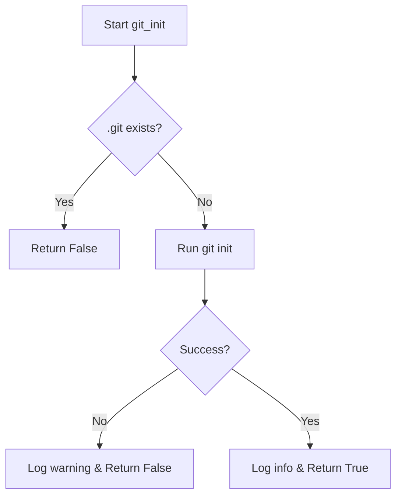
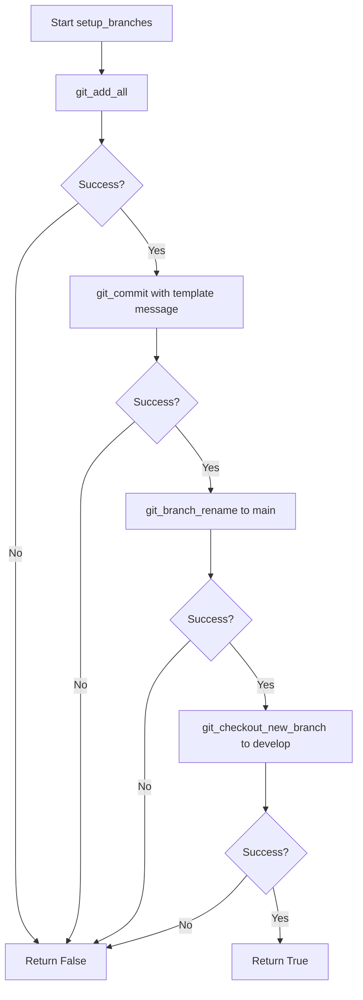

# scitex.git

Git operations module for scitex.

## Recent Improvements (2025-10-29)

The git module has been significantly enhanced with rich result types, comprehensive validation, and improved error handling. See:
- **[IMPROVEMENTS.md](./IMPROVEMENTS.md)** - Detailed documentation of all improvements
- **[EVAL.md](./EVAL.md)** - Comprehensive evaluation and implementation notes

### Quick Migration

```python
# Old API (still supported)
from scitex.git import git_commit
success = git_commit(repo, "message")

# New API (recommended for new code)
from scitex.git.commit_v01_with_result_types import git_commit_v2
result = git_commit_v2(repo, "message")
if result.success:
    print(f"Commit created: {result.commit_hash}")
else:
    print(f"Error: {result.message}")
```

Module grade: **B- → A-** (see EVAL.md for details)

## Workflow Diagrams

### git_init Logic



### setup_branches Strategy



## Modules

- branch.py: Branch operations
- clone.py: Repository initialization and cloning
- commit.py: Staging and committing
- remote.py: Remote URL handling
- workflow.py: High-level workflows
- utils.py: Shared utilities

## Functions

### Branch Operations

```python
from scitex.git.branch import git_branch_rename, git_checkout_new_branch

git_branch_rename(repo_path, "new-name")
git_checkout_new_branch(repo_path, "feature-branch")
```

### Clone Operations

```python
from scitex.git.clone import clone_repo, git_init

clone_repo("https://github.com/user/repo.git", target_path)
git_init(repo_path)
```

### Commit Operations

```python
from scitex.git.commit import git_add_all, git_commit

git_add_all(repo_path)
git_commit(repo_path, "commit message")
```

### Remote Operations

```python
from scitex.git.remote import get_remote_url, is_cloned_from

url = get_remote_url(repo_path)
is_same = is_cloned_from(repo_path, expected_url)
```

## Supported Platforms

- GitHub: github.com
- GitLab: gitlab.com
- Bitbucket: bitbucket.org

Both HTTPS and SSH URL formats are supported.

## Tests

```bash
pytest tests/scitex/git/
```
