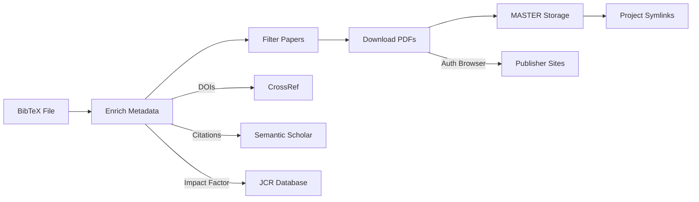

<!-- ---
!-- Timestamp: 2025-10-07 17:55:19
!-- Author: ywatanabe
!-- File: /home/ywatanabe/proj/scitex_repo/src/scitex/scholar/README.md
!-- --- -->

# SciTeX Scholar

A comprehensive Python library for scientific literature management with automatic enrichment, PDF download capabilities, and persistent storage organization.

## 🌟 Key Features

- **Unified CLI** - Flexible command-line interface with combinable operations
- **Automatic Enrichment** - Resolve DOIs, abstracts, citations, and impact factors
- **PDF Downloads** - Authenticated browser automation for institutional access
- **MASTER Storage** - Centralized storage with project-based organization
- **Project Management** - Persistent library with metadata tracking
- **Smart Caching** - Resume interrupted operations seamlessly

## 📚 Storage Architecture

```
~/.scitex/scholar/library/
├── MASTER/                     # Centralized storage
│   ├── 8DIGIT01/              # Hash-based unique ID from DOI
│   │   ├── metadata.json      # Complete paper metadata
│   │   └── paper.pdf          # Downloaded PDF
│   └── 8DIGIT02/
│       ├── metadata.json
│       └── paper.pdf
├── project_name/               # Project-specific symlinks
│   ├── Author-Year-Journal -> ../MASTER/8DIGIT01
│   └── Author-Year-Journal -> ../MASTER/8DIGIT02
└── neurovista/
    ├── Cook-2013-Lancet -> ../MASTER/8DIGIT03
    └── ...
```

## 🚀 Quick Start

### Installation

```bash
# From SciTeX repository
cd /home/ywatanabe/proj/scitex_repo
pip install -e .

# Or for development
cd /home/ywatanabe/proj/SciTeX-Code
pip install -e .
```

### Basic Workflow

```bash
# 1. Enrich a BibTeX file (resolve DOIs, abstracts, citations) with automatic project creation
python -m scitex.scholar --bibtex papers.bib --project myresearch --enrich --output enriched.bib

# 2. Download PDFs to MASTER library with project organization (requires authentication)
python -m scitex.scholar --bibtex enriched.bib --project myresearch --download

# Or do both in one command (if you have authentication set up)
python -m scitex.scholar --bibtex papers.bib --project myresearch --enrich --download
```

**Note**: Projects are created automatically when first used - no need for explicit creation!

### Complete Working Example: Neurovista Dataset

```bash
# Navigate to scholar directory
cd /home/ywatanabe/proj/scitex_repo/src/scitex/scholar

# Step 1: Enrich the neurovista BibTeX file
python -m scitex.scholar \
    --bibtex data/neurovista.bib \
    --output data/neurovista_enriched.bib \
    --project neurovista \
    --enrich

# Step 2: Create project directory, and download all PDFs
python -m scitex.scholar \
    --bibtex data/neurovista_enriched.bib \
    --project neurovista \
    --download

# Step 3: Check what was downloaded
python -m scitex.scholar --project neurovista --list

# Step 4: Export high-impact papers only
python -m scitex.scholar \
    --project neurovista \
    --min-citations 100 \
    --min-impact-factor 10.0 \
    --export data/neurovista_high_impact.bib

# Step 5: View library statistics
python -m scitex.scholar --stats
```

### Working with Existing Enriched Data

```bash
# If you already have enriched data (e.g., pac-seizure_prediction_enriched.bib)
python -m scitex.scholar \
    --bibtex data/pac-seizure_prediction_enriched.bib \
    --project seizure_research \
    --min-citations 50 \
    --min-impact-factor 5.0 \
    --download
```

## 📋 Unified CLI Reference

### Input Sources

```bash
--bibtex FILE           # Path to BibTeX file
--doi DOI               # Single DOI to process
--dois DOI [DOI ...]    # Multiple DOIs
--title TITLE           # Paper title for search/resolution
```

### Operations

```bash
--enrich, -e            # Enrich papers with metadata (DOIs, abstracts, citations)
--download, -d          # Download PDFs to MASTER library
--list, -l              # List papers in project
--search QUERY, -s      # Search papers in library
--stats                 # Show library statistics
--export FILE           # Export project (format from extension: .bib, .csv, .json)
```

### Project Management

```bash
--project NAME, -p              # Project name for persistent storage (auto-created when needed)
--project-description TEXT      # Optional project description
```

### Filtering Options

```bash
--year-min YEAR         # Minimum publication year
--year-max YEAR         # Maximum publication year
--min-citations N       # Minimum citation count
--min-impact-factor F   # Minimum journal impact factor
--has-pdf              # Only papers with PDFs
```

## 📖 Complete Examples

### Example 1: Literature Review Pipeline (Real Data)

```bash
# Step 1: Get BibTeX from AI2 Scholar QA (https://scholarqa.allen.ai/chat/)
# Or use existing data files in the repository

cd /home/ywatanabe/proj/scitex_repo/src/scitex/scholar

# Step 2: Create project and enrich papers
python -m scitex.scholar \
    --bibtex data/pac-seizure_prediction.bib \
    --project seizure_review \
    --create-project \
    --description "Seizure prediction literature review" \
    --enrich \
    --output data/seizure_enriched.bib

# Step 3: Download PDFs for high-impact papers
python -m scitex.scholar \
    --bibtex data/seizure_enriched.bib \
    --project seizure_review \
    --min-citations 50 \
    --min-impact-factor 5.0 \
    --download

# Step 4: Export filtered results
python -m scitex.scholar \
    --project seizure_review \
    --year-min 2020 \
    --export data/recent_seizure_papers.bib
```

### Example 2: Single Paper Download (Working Examples)

```bash
# Download a single paper by DOI (from neurovista dataset)
python -m scitex.scholar \
    --doi "10.1093/brain/awx098" \
    --project neurovista \
    --download

# Or multiple DOIs (actual papers from neurovista)
python -m scitex.scholar \
    --dois "10.1371/journal.pone.0081920" "10.1093/braincomms/fcac115" \
    --project neurovista \
    --enrich \
    --download

# Download specific high-impact paper
python -m scitex.scholar \
    --doi "10.1016/s1474-4422(13)70075-9" \
    --project seizure_research \
    --download
```

### Example 3: Project Management

```bash
# List all papers in a project
python -m scitex.scholar --project neurovista --list

# Search across all projects
python -m scitex.scholar --search "seizure prediction"

# Search within specific project
python -m scitex.scholar --project neurovista --search "EEG"

# Show library statistics
python -m scitex.scholar --stats

# Export project to different formats
python -m scitex.scholar --project neurovista --export papers.json
python -m scitex.scholar --project neurovista --export papers.bib
python -m scitex.scholar --project neurovista --export papers.csv  # Coming soon
```

## 🐍 Python API

```python
from scitex.scholar import Scholar

# Initialize with project
scholar = Scholar(project="neurovista")

# Load and enrich papers
papers = scholar.load_bibtex("papers.bib")
enriched = scholar.enrich_papers(papers)

# Filter papers
filtered = enriched.filter(
    year_min=2020,
    min_citations=50,
    min_impact_factor=5.0,
    has_pdf=True
)

# Download PDFs (stored in MASTER with project symlinks)
import asyncio
dois = [p.doi for p in filtered if p.doi]
results = asyncio.run(scholar.download_pdfs_from_dois_async(dois))

# Save to different formats
scholar.save_papers_as_bibtex(enriched, "output.bib")
scholar.save_papers_to_library(enriched)

# Search and analyze
results = scholar.search_library("seizure prediction")
stats = scholar.get_library_statistics()
```

## 🔧 Advanced Features

### Browser Authentication

For institutional access to paywalled papers:

```bash
# Open authenticated browser for manual login
python -m scitex.scholar chrome

# Use stealth or interactive mode for downloads
python -m scitex.scholar --bibtex papers.bib --download --browser interactive
```

### Batch Processing

```python
from scitex.scholar import Scholar
from pathlib import Path

scholar = Scholar(project="review_2024")

# Process multiple BibTeX files
for bib_file in Path("references").glob("*.bib"):
    papers = scholar.load_bibtex(bib_file)
    enriched = scholar.enrich_papers(papers)

    # Save with source tracking
    output = bib_file.parent / f"{bib_file.stem}_enriched.bib"
    scholar.save_papers_as_bibtex(enriched, output)
```

### Custom Filtering

```python
# Complex filtering with Papers object
papers = scholar.load_bibtex("papers.bib")

# Filter by multiple criteria
high_impact = papers.filter(
    year_min=2020,
    min_citations=100,
    min_impact_factor=10.0,
    journal="Nature",  # Partial match
    keyword="neural"    # Search in title, abstract, keywords
)

# Custom lambda filtering
recent_nature = papers.filter(
    condition=lambda p: p.year >= 2023 and "Nature" in (p.journal or "")
)

# Sort results
sorted_papers = high_impact.sort_by(["impact_factor", "citations"], ascending=False)
```

## 📁 Data Sources

1. **Get BibTeX files from AI2 Scholar QA**
   - Visit [Scholar QA](https://scholarqa.allen.ai/chat/)
   - Ask literature questions
   - Click "Export All Citations" to get BibTeX

2. **Enrichment Sources**
   - DOI resolution: CrossRef, Semantic Scholar, PubMed
   - Impact factors: JCR 2024 database
   - Citations: Semantic Scholar API
   - PDFs: Publisher sites via institutional access

## 🎯 Workflow Summary



## 📊 Library Structure Benefits

- **Deduplication**: Same paper across projects stored once in MASTER
- **Organization**: Human-readable symlinks in project directories
- **Metadata**: Complete tracking in metadata.json files
- **Scalability**: Hash-based IDs prevent naming conflicts
- **Persistence**: Projects persist across sessions

## Citation

If you use SciTeX in your research, please cite:

```bibtex
@software{scitex,
  title = {SciTeX: A Python Toolbox for Scientific Research},
  author = {Yusuke Watanabe},
  year = {2025},
  url = {https://github.com/ywatanabe1989/SciTeX-Code}
}
```

## License

MIT

## Contact

Yusuke Watanabe (ywatanabe@scitex.ai)

<!-- EOF -->