<!-- ---
!-- Timestamp: 2025-10-01 14:05:29
!-- Author: ywatanabe
!-- File: /ssh:sp:/home/ywatanabe/proj/scitex_repo/src/scitex/stats/README.md
!-- --- -->

# SciTeX Stats - Professional Statistical Testing Framework

**Version 2.1.0** | 23 Tests | 4 Corrections | 3 Post-hoc | Publication-Ready

[](https://www.python.org/downloads/)
[](LICENSE)
[]()

A comprehensive statistical testing framework with clean, normalized API for scientific research. Features 23 tests, 4 corrections, 3 post-hoc methods, publication-quality outputs, automatic assumption checking, and 9 export formats.

---

## 🎯 Key Features

- **23 Statistical Tests**: Parametric (6), non-parametric (5), normality (4), correlation (3), categorical (4)
- **4 Multiple Comparison Corrections**: Bonferroni, FDR (BH/BY), Holm, Šidák
- **3 Post-hoc Tests**: Tukey HSD, Games-Howell, Dunnett
- **Comprehensive Effect Sizes**: Cohen's d, Cliff's delta, P(X>Y), η² (eta-squared), partial η², ε² (epsilon-squared), rank-biserial correlation, Cramér's V, Odds ratio, Kendall's W, Kendall's tau
- **Automatic Assumption Checking**: Built-in normality and homogeneity tests (Shapiro-Wilk, Levene, Mauchly's sphericity)
- **Publication-Ready Visualizations**: High-quality plots with significance annotations
- **9 Export Formats**: Excel (styled), CSV, JSON, LaTeX, Markdown, HTML, Text, DataFrame, Dict
- **Professional Branding**: SciTeX Stats signature on all outputs
- **Consistent API**: Unified `plot` and `return_as` parameters across all tests
- **Power Analysis**: Statistical power computation and sample size determination
- **Confidence Intervals**: Fisher's z-transformation for correlation coefficients

---

## 📦 Installation

```python
import scitex as stx
from scitex.stats import *
```

---

## 🗺️ Test Selection Guide

```mermaid
flowchart TD
    Start([What are you testing?])

    Start --> DataType{Data Type?}

    DataType -->|Continuous| Continuous
    DataType -->|Categorical| Categorical
    DataType -->|Correlation| Correlation

    %% Continuous path
    Continuous{How many groups?}
    Continuous -->|1 group| OneSample[One sample vs value]
    Continuous -->|2 groups| TwoGroups
    Continuous -->|3+ groups| ThreeGroups

    OneSample --> OneNorm{Normal?}
    OneNorm -->|Yes| TTest1[test_ttest_1samp]
    OneNorm -->|No| Wilcoxon[test_wilcoxon]

    TwoGroups{Independent or Paired?}
    TwoGroups -->|Independent| TwoInd
    TwoGroups -->|Paired| TwoPaired

    TwoInd{Normal & Equal var?}
    TwoInd -->|Yes| TTestInd[test_ttest_ind]
    TwoInd -->|No, Normal| Welch[test_ttest_ind<br/>equal_var=False]
    TwoInd -->|Not Normal| MW[test_mannwhitneyu or<br/>test_brunner_munzel]

    TwoPaired{Normal differences?}
    TwoPaired -->|Yes| TTestRel[test_ttest_rel]
    TwoPaired -->|No| WilcoxonSigned[test_wilcoxon]

    ThreeGroups{Independent or Repeated?}
    ThreeGroups -->|Independent| ThreeInd
    ThreeGroups -->|Repeated| ThreeRep
    ThreeGroups -->|Two Factors| TwoWay[test_anova_2way]

    ThreeInd{Normal & Homogeneous?}
    ThreeInd -->|Yes| ANOVA[test_anova]
    ThreeInd -->|Not Normal| Kruskal[test_kruskal]

    ANOVA --> ANOVASig{Significant?}
    ANOVASig -->|Yes| PostHoc{Variance equal?}
    PostHoc -->|Yes, All pairs| Tukey[posthoc_tukey]
    PostHoc -->|No, All pairs| GH[posthoc_games_howell]
    PostHoc -->|Yes, vs Control| Dunnett[posthoc_dunnett]

    Kruskal --> KruskalSig{Significant?}
    KruskalSig -->|Yes| PairwiseNP[Pairwise Mann-Whitney<br/>+ Bonferroni/FDR]

    ThreeRep{Sphericity met?}
    ThreeRep -->|Yes/Corrected| ANOVARM[test_anova_rm]
    ThreeRep -->|Not Normal| Friedman[test_friedman]

    %% Categorical path
    Categorical{Independent or Paired?}
    Categorical -->|Independent| CatInd
    Categorical -->|Paired| CatPaired

    CatInd{Table size?}
    CatInd -->|2×2 or larger| ChiLarge{Expected > 5?}
    CatInd -->|2×2, small| Fisher[test_fisher]

    ChiLarge -->|Yes| ChiSquare[test_chisquare]
    ChiLarge -->|No| Fisher

    CatPaired{Binary?}
    CatPaired -->|Yes, 2 times| McNemar[test_mcnemar]
    CatPaired -->|Yes, 3+ times| CochranQ[test_cochran_q]

    %% Correlation path
    Correlation{Data properties?}
    Correlation -->|Linear, Normal| Pearson[test_pearson]
    Correlation -->|Monotonic, not Normal| Spearman[test_spearman]
    Correlation -->|Small n, many ties| Kendall[test_kendall]

    %% Styling
    classDef testNode fill:#e1f5ff,stroke:#0077be,stroke-width:2px
    classDef postHocNode fill:#fff4e1,stroke:#ff9800,stroke-width:2px
    classDef decisionNode fill:#f0f0f0,stroke:#666,stroke-width:1px

    class TTest1,Wilcoxon,TTestInd,Welch,MW,TTestRel,WilcoxonSigned,ANOVA,Kruskal,ANOVARM,Friedman,TwoWay,ChiSquare,Fisher,McNemar,CochranQ,Pearson,Spearman,Kendall testNode
    class Tukey,GH,Dunnett,PairwiseNP postHocNode
```



**Key Decision Points:**
- **Normality**: Use Shapiro-Wilk (`test_shapiro`) or visual Q-Q plots
- **Equal Variance**: Use Levene's test (included in `test_anova` with `check_assumptions=True`)
- **Sphericity**: Mauchly's test (automatic in `test_anova_rm`)
- **Sample Size**: Fisher's exact for small expected counts (<5)

---

## 🧪 Available Tests

### Normality Tests

#### Shapiro-Wilk Test
Test for normality with Q-Q plot visualization.

```python
from scitex.stats.tests.normality import test_shapiro, test_normality

# Single sample
result = test_shapiro(data, var_x='Sample', plot=True)
print(f"Normal: {result['normal']}")

# Multiple samples (utility)
check = test_normality(x, y, z, var_names=['X', 'Y', 'Z'])
print(check['recommendation'])
```

**Features:**
- W statistic and p-value
- Q-Q plots for visual assessment
- Sample size warnings
- Recommendations for parametric vs non-parametric tests

#### Kolmogorov-Smirnov Test
Test against any continuous distribution or compare two samples.

```python
from scitex.stats.tests.normality import test_ks_1samp, test_ks_2samp

# One-sample (test against reference distribution)
result = test_ks_1samp(data, cdf='norm', args=(0, 1))

# Two-sample (compare distributions)
result = test_ks_2samp(x, y, var_x='Group A', var_y='Group B', plot=True)
```

**Features:**
- One-sample: test against any scipy.stats distribution
- Two-sample: compare empirical distributions
- CDF comparison plots
- Less powerful than Shapiro-Wilk for normality, but more general

---

### Parametric Tests

#### Independent Samples t-Test
Compare means of two independent groups.

```python
from scitex.stats.tests.parametric import test_ttest_ind

result = test_ttest_ind(
    x, y,
    var_x='Control',
    var_y='Treatment',
    equal_var=True,  # Use Welch's t-test if False
    plot=True
)

print(f"t = {result['statistic']:.3f}, p = {result['pvalue']:.4f}")
print(f"Cohen's d = {result['effect_size']:.3f} ({result['effect_size_interpretation']})")
print(f"Power = {result['power']:.3f}")
```

**Features:**
- Student's t-test and Welch's t-test
- Cohen's d effect size
- Statistical power computation
- Histogram + box plot visualizations

#### Paired Samples t-Test
Compare means of paired observations.

```python
from scitex.stats.tests.parametric import test_ttest_rel

result = test_ttest_rel(
    before, after,
    var_x='Before',
    var_y='After',
    plot=True
)
```

**Features:**
- Paired Cohen's d
- Before-after difference plots
- Automatic normality checking of differences

#### One-Sample t-Test
Test if sample mean differs from a population value.

```python
from scitex.stats.tests.parametric import test_ttest_1samp

result = test_ttest_1samp(sample, popmean=100, var_x='Scores')
```

#### One-Way ANOVA
Compare means of 3+ independent groups.

```python
from scitex.stats.tests.parametric import test_anova

result = test_anova(
    [group1, group2, group3],
    var_names=['Control', 'Treatment 1', 'Treatment 2'],
    check_assumptions=True,  # Automatic normality & homogeneity checks
    plot=True
)

print(f"F({result['df_between']}, {result['df_within']}) = {result['statistic']:.3f}")
print(f"η² = {result['effect_size']:.3f}")
print(f"Assumptions met: {result['assumptions_met']}")
```

**Features:**
- Eta-squared (η²) effect size
- Automatic normality checking (Shapiro-Wilk for each group)
- Automatic homogeneity of variance checking (Levene's test)
- 4-panel visualization: box plots, violin plots, histograms, Q-Q plots
- Post-hoc recommendations with correction methods

#### Repeated Measures ANOVA
Compare means across multiple conditions (within-subjects).

```python
from scitex.stats.tests.parametric import test_anova_rm

# Wide format: subjects × conditions
data = np.array([
    [5.2, 6.1, 7.3, 6.8],  # Subject 1
    [4.8, 5.9, 6.7, 6.2],  # Subject 2
    [5.5, 6.4, 7.1, 7.0],  # Subject 3
])

result = test_anova_rm(
    data,
    condition_names=['Baseline', 'Week 1', 'Week 2', 'Week 3'],
    correction='auto',  # Apply GG correction if sphericity violated
    plot=True
)

print(f"F({result['df_effect']:.1f}, {result['df_error']:.1f}) = {result['statistic']:.3f}")
print(f"Sphericity met: {result['sphericity_met']}")
print(f"Partial η² = {result['effect_size']:.3f}")
```

**Features:**
- Sphericity testing (Mauchly's test)
- Greenhouse-Geisser correction when sphericity violated
- Partial eta-squared effect size
- Profile plots showing individual trajectories and mean
- Supports wide and long format data

#### Two-Way ANOVA
Factorial design with two factors and interaction.

```python
from scitex.stats.tests.parametric import test_anova_2way

results = test_anova_2way(
    data,
    factor_a='Drug',
    factor_b='Gender',
    value='Score',
    plot=True
)

# Results is a list of 3 effects
for effect in results:
    print(f"{effect['effect']}: F = {effect['statistic']:.2f}, p = {effect['pvalue']:.4f}")
```

**Features:**
- Tests main effects of both factors
- Tests interaction effect (A × B)
- Partial eta-squared for each effect
- Interaction plots (both directions)
- Marginal means visualization
- Supports balanced and unbalanced designs

---

### Non-Parametric Tests

#### Brunner-Munzel Test
Robust alternative to independent t-test with dual effect sizes.

```python
from scitex.stats.tests.nonparametric import test_brunner_munzel

result = test_brunner_munzel(x, y, var_x='Group A', var_y='Group B', plot=True)

print(f"Primary effect: P(X>Y) = {result['effect_size']:.3f}")
print(f"Secondary effect: Cliff's δ = {result['effect_size_secondary']:.3f}")
```

**Features:**
- Dual effect sizes: P(X>Y) and Cliff's delta
- Robust to non-normality, unequal variances, outliers
- Q-Q plots and distribution visualizations
- More powerful than Mann-Whitney U when assumptions relaxed

#### Wilcoxon Signed-Rank Test
Non-parametric paired test.

```python
from scitex.stats.tests.nonparametric import test_wilcoxon

result = test_wilcoxon(before, after, var_x='Before', var_y='After')

print(f"Rank-biserial r = {result['effect_size']:.3f}")
print(f"n_zeros = {result['n_zeros']}")  # Ties removed
```

**Features:**
- Rank-biserial correlation effect size
- Handles ties appropriately
- Alternative to paired t-test for non-normal data

#### Kruskal-Wallis H Test
Non-parametric alternative to one-way ANOVA.

```python
from scitex.stats.tests.nonparametric import test_kruskal

result = test_kruskal(
    [group1, group2, group3, group4],
    var_names=['Dose 0', 'Dose 1', 'Dose 2', 'Dose 3'],
    plot=True
)

print(f"H = {result['statistic']:.3f}")
print(f"ε² = {result['effect_size']:.3f}")
```

**Features:**
- Epsilon-squared (ε²) effect size
- Box plots and violin plots
- Works with ordinal data (e.g., Likert scales)
- Post-hoc pairwise comparison workflow

#### Mann-Whitney U Test
Compare medians of two independent groups.

```python
from scitex.stats.tests.nonparametric import test_mannwhitneyu

result = test_mannwhitneyu(x, y, var_x='Group A', var_y='Group B', plot=True)

print(f"U = {result['statistic']:.1f}")
print(f"Rank-biserial r = {result['effect_size']:.3f}")
```

**Features:**
- Rank-biserial correlation effect size
- 4-panel visualization: box plots, histograms, rank distribution, CDF
- Robust to outliers
- Works with ordinal data

---

### Correlation Tests

#### Pearson Correlation
Linear correlation between two continuous variables.

```python
from scitex.stats.tests.correlation import test_pearson

result = test_pearson(x, y, var_x='Height', var_y='Weight', plot=True)

print(f"r = {result['statistic']:.3f}")
print(f"95% CI [{result['ci_lower']:.3f}, {result['ci_upper']:.3f}]")
print(f"R² = {result['r_squared']:.3f} ({result['r_squared']*100:.1f}% variance explained)")
```

**Features:**
- Pearson's r with p-value
- Confidence intervals (Fisher's z-transformation)
- R² (coefficient of determination)
- Scatter plot with regression line
- Residual plot for linearity checking
- Effect size interpretation (Cohen, 1988)

#### Spearman Correlation
Non-parametric monotonic correlation (rank-based).

```python
from scitex.stats.tests.correlation import test_spearman

result = test_spearman(x, y, var_x='Income', var_y='Happiness', plot=True)

print(f"ρ = {result['statistic']:.3f}")
print(f"ρ² = {result['rho_squared']:.3f}")
print(f"Interpretation: {result['effect_size_interpretation']}")
```

**Features:**
- Spearman's ρ (rho) with p-value
- ρ² for variance explained
- Robust to outliers and non-linear relationships
- 2-panel visualization (original data + rank plots)
- Works with ordinal data

---

### Categorical Tests

#### Chi-square Test
Test independence between categorical variables.

```python
from scitex.stats.tests.categorical import test_chi2

# 2×2 contingency table
observed = np.array([[30, 10], [20, 40]])

result = test_chi2(
    observed,
    var_row='Treatment',
    var_col='Outcome',
    plot=True
)

print(f"χ² = {result['statistic']:.2f}, p = {result['pvalue']:.4f}")
print(f"Cramér's V = {result['effect_size']:.3f} ({result['effect_size_interpretation']})")
```

**Features:**
- Chi-square statistic with degrees of freedom
- Cramér's V effect size
- Yates' correction for 2×2 tables
- 3-panel visualization (observed, expected, residuals)
- Works with any size contingency table

#### Fisher's Exact Test
Exact test for 2×2 tables (small samples).

```python
from scitex.stats.tests.categorical import test_fisher

# 2×2 table with small counts
observed = [[8, 2], [1, 5]]

result = test_fisher(
    observed,
    var_row='Group',
    var_col='Response',
    plot=True
)

print(f"Odds Ratio = {result['statistic']:.2f}")
print(f"95% CI [{result['ci_lower']:.2f}, {result['ci_upper']:.2f}]")
```

**Features:**
- Exact p-values (no approximation)
- Odds ratio with confidence intervals
- Works well with small expected frequencies (<5)
- 2-panel visualization (frequencies + proportions)
- One-sided or two-sided alternatives

#### McNemar's Test
Test for paired categorical data (before/after studies).

```python
from scitex.stats.tests.categorical import test_mcnemar

# Before/after treatment (paired data)
# Rows: before, Columns: after
observed = [[59, 6],   # Stayed negative (59), improved (6)
            [16, 19]]  # Relapsed (16), stayed positive (19)

result = test_mcnemar(
    observed,
    var_before='Before Treatment',
    var_after='After Treatment',
    correction=True,  # Continuity correction (recommended)
    plot=True
)

print(f"χ² = {result['statistic']:.2f}, p = {result['pvalue']:.4f}")
print(f"Discordant pairs: b={result['b']}, c={result['c']}")
print(f"Odds Ratio = {result['odds_ratio']:.2f} ({result['effect_size_interpretation']})")
```

**Features:**
- Tests marginal homogeneity for paired data
- Continuity correction for small samples
- Odds ratio for matched pairs (b/c)
- 3-panel visualization (table, discordant pairs, results)
- Appropriate for before-after studies with binary outcomes

---

## 🔧 Multiple Comparison Corrections

### Bonferroni Correction
Conservative family-wise error rate (FWER) control.

```python
from scitex.stats.correct import correct_bonferroni

# Perform multiple t-tests
results = [
    test_ttest_ind(x1, y1),
    test_ttest_ind(x2, y2),
    test_ttest_ind(x3, y3)
]

# Apply correction
corrected = correct_bonferroni(results, alpha=0.05)

for r in corrected:
    print(f"{r['var_x']} vs {r['var_y']}: p_adj = {r['pvalue_adjusted']:.4f}, rejected = {r['rejected']}")
```

### FDR Correction (Benjamini-Hochberg & Benjamini-Yekutieli)
Less conservative, controls false discovery rate.

```python
from scitex.stats.correct import correct_fdr

# Benjamini-Hochberg (default)
corrected_bh = correct_fdr(results, method='bh', alpha=0.05)

# Benjamini-Yekutieli (for dependent tests)
corrected_by = correct_fdr(results, method='by', alpha=0.05)
```

**When to use:**
- Multiple pairwise comparisons after ANOVA/Kruskal-Wallis
- More powerful than Bonferroni for large m
- BH: assumes independence or positive dependence
- BY: works for any dependence structure

### Holm Correction
Sequential Bonferroni, uniformly more powerful.

```python
from scitex.stats.correct import correct_holm

corrected = correct_holm(results, alpha=0.05)

print(f"Holm rejections: {sum(r['rejected'] for r in corrected)}/{len(results)}")
```

**Features:**
- Step-down procedure
- More powerful than standard Bonferroni
- Still controls FWER at level α
- Comparison examples showing increased power

### Šidák Correction
Less conservative than Bonferroni, assumes independence.

```python
from scitex.stats.correct import correct_sidak

corrected = correct_sidak(results, alpha=0.05)

print(f"Šidák alpha: {corrected[0]['alpha_adjusted']:.6f}")
print(f"Bonferroni alpha: {alpha/len(results):.6f}")
```

**When to use:**
- When tests are truly independent
- When Bonferroni is too conservative
- Formula: α_adj = 1 - (1-α)^(1/m)
- More powerful than Bonferroni under independence

---

## 🔬 Post-hoc Tests

After finding a significant ANOVA result, post-hoc tests identify which specific groups differ.

### Tukey HSD (Honestly Significant Difference)
All pairwise comparisons with equal variance assumption.

```python
from scitex.stats.posthoc import posthoc_tukey

# After significant ANOVA
groups = [control, treatment1, treatment2, treatment3]
names = ['Control', 'T1', 'T2', 'T3']

results = posthoc_tukey(
    groups,
    group_names=names,
    alpha=0.05
)

# View significant pairs
sig_pairs = results[results['significant']]
print(sig_pairs[['group_i', 'group_j', 'mean_diff', 'pvalue']])
```

**Features:**
- Controls family-wise error rate exactly at α
- Studentized range distribution
- Confidence intervals for differences
- More powerful than Bonferroni for all pairwise comparisons
- Supports unbalanced designs (Tukey-Kramer)

### Games-Howell Test
Robust alternative when variances are unequal (no homogeneity assumption).

```python
from scitex.stats.posthoc import posthoc_games_howell

# Use when Levene's test shows heteroscedasticity
results = posthoc_games_howell(
    groups,
    group_names=names,
    alpha=0.05
)
```

**Features:**
- Does NOT assume equal variances
- Welch-Satterthwaite degrees of freedom
- More accurate than Tukey HSD when homogeneity violated
- Robust to variance heterogeneity
- Slightly less powerful than Tukey when variances are equal

### Dunnett's Test
Compare multiple treatments against a single control (more powerful than Tukey for this design).

```python
from scitex.stats.posthoc import posthoc_dunnett

results = posthoc_dunnett(
    control=placebo,
    treatments=[dose_low, dose_med, dose_high],
    treatment_names=['Low', 'Med', 'High'],
    control_name='Placebo',
    alternative='two-sided'  # or 'greater', 'less'
)
```

**Features:**
- Specifically designed for control vs treatment comparisons
- More powerful than Tukey HSD for this purpose
- Supports one-sided and two-sided tests
- Common in drug trials and baseline comparisons

**When to use which post-hoc:**
- **Tukey HSD**: All pairwise comparisons, equal variances
- **Games-Howell**: All pairwise comparisons, unequal variances
- **Dunnett**: Multiple treatments vs single control

---

## 📊 Export Capabilities

All tests support 9 export formats with professional branding:

```python
from scitex.stats.utils import convert_results

# Single result - multiple formats
result = test_ttest_ind(x, y)

# Excel (with conditional formatting)
convert_results(result, return_as='excel', path='results.xlsx')

# CSV (with signature comment)
convert_results(result, return_as='csv', path='results.csv')

# JSON (with metadata)
convert_results(result, return_as='json', path='results.json')

# LaTeX table
convert_results(result, return_as='latex', path='table.tex')

# Markdown report
convert_results(result, return_as='markdown', path='report.md')

# HTML report (styled)
convert_results(result, return_as='html', path='report.html')

# Plain text
convert_results(result, return_as='text', path='report.txt')

# DataFrame
df = convert_results(result, return_as='dataframe')

# Dict (default)
d = convert_results(result, return_as='dict')
```

### Excel Features
- **Conditional formatting**: Red (p<0.001), Orange (p<0.01), Yellow (p<0.05), Gray (p≥0.05)
- **Bold fonts** for significant results
- **Frozen header row** (A2) for smooth scrolling
- **SciTeX Stats branding** at bottom with timestamp

---

## 🔬 Effect Sizes

All tests include appropriate effect sizes with interpretations:

| Effect Size | Used In | Interpretation |
|------------|---------|----------------|
| **Cohen's d** | t-tests | < 0.2: negligible, < 0.5: small, < 0.8: medium, ≥ 0.8: large |
| **Hedges' g** | t-tests (small n) | Bias-corrected Cohen's d |
| **Glass's Δ** | t-tests | Uses control group SD only |
| **Cliff's delta** | Brunner-Munzel | < 0.147: negligible, < 0.33: small, < 0.474: medium, ≥ 0.474: large |
| **P(X>Y)** | Brunner-Munzel | Probability of superiority |
| **η² (eta-squared)** | ANOVA | < 0.01: negligible, < 0.06: small, < 0.14: medium, ≥ 0.14: large |
| **ε² (epsilon-squared)** | Kruskal-Wallis | Non-parametric analog of η² |
| **Rank-biserial r** | Wilcoxon, Mann-Whitney U | < 0.1: negligible, < 0.3: small, < 0.5: medium, ≥ 0.5: large |
| **Pearson's r** | Correlation | < 0.1: negligible, < 0.3: small, < 0.5: medium, ≥ 0.5: large |
| **Spearman's ρ** | Correlation | < 0.1: negligible, < 0.3: small, < 0.5: medium, ≥ 0.5: large |
| **R² / ρ²** | Correlation | Proportion of variance explained |
| **Cramér's V** | Chi-square | < 0.1: negligible, < 0.3: small, < 0.5: medium, ≥ 0.5: large |
| **Odds ratio** | Fisher's exact | 1 = no association, >1 = positive, <1 = negative |

---

## 📈 Complete Workflow Examples

### Example 1: Post-hoc Analysis After ANOVA

```python
from scitex.stats.tests.parametric import test_anova, test_ttest_ind
from scitex.stats.correct import correct_holm

# Step 1: Overall ANOVA
groups = [control, treatment1, treatment2]
names = ['Control', 'Treatment 1', 'Treatment 2']

anova_result = test_anova(groups, var_names=names, check_assumptions=True)

if anova_result['rejected'] and anova_result['assumptions_met']:
    print("Overall ANOVA significant. Performing post-hoc pairwise t-tests...")

    # Step 2: Pairwise comparisons
    pairwise_results = []
    for i in range(len(groups)):
        for j in range(i + 1, len(groups)):
            result = test_ttest_ind(groups[i], groups[j], var_x=names[i], var_y=names[j])
            pairwise_results.append(result)

    # Step 3: Apply Holm correction
    corrected = correct_holm(pairwise_results, alpha=0.05)

    # Step 4: Export results
    from scitex.stats.utils import convert_results
    convert_results(corrected, return_as='excel', path='posthoc_results.xlsx')
```

### Example 2: Non-parametric Workflow

```python
from scitex.stats.tests.normality import test_normality
from scitex.stats.tests.nonparametric import test_kruskal, test_brunner_munzel
from scitex.stats.correct import correct_bonferroni

# Step 1: Check normality
normality_check = test_normality(group1, group2, group3,
                                 var_names=['Group 1', 'Group 2', 'Group 3'])

if not normality_check['all_normal']:
    print(normality_check['recommendation'])

    # Step 2: Use Kruskal-Wallis instead of ANOVA
    kruskal_result = test_kruskal([group1, group2, group3],
                                   var_names=['Group 1', 'Group 2', 'Group 3'],
                                   plot=True)

    if kruskal_result['rejected']:
        # Step 3: Post-hoc with Brunner-Munzel
        pairwise = []
        for i in range(3):
            for j in range(i + 1, 3):
                result = test_brunner_munzel(groups[i], groups[j])
                pairwise.append(result)

        # Step 4: Apply correction
        corrected = correct_bonferroni(pairwise)
```

### Example 3: Correlation Analysis

```python
from scitex.stats.tests.correlation import test_pearson
from scitex.stats.correct import correct_bonferroni

# Multiple correlation tests
data = {
    'Age': age_data,
    'Income': income_data,
    'Education': education_data,
    'Health': health_data
}

results = []
pairs = [('Age', 'Income'), ('Age', 'Education'), ('Age', 'Health'),
         ('Income', 'Education'), ('Income', 'Health'), ('Education', 'Health')]

for var1, var2 in pairs:
    result = test_pearson(data[var1], data[var2], var_x=var1, var_y=var2)
    results.append(result)

# Apply Bonferroni correction for multiple correlations
corrected = correct_bonferroni(results, alpha=0.05)

# Export correlation matrix
from scitex.stats.utils import convert_results
convert_results(corrected, return_as='excel', path='correlation_matrix.xlsx')
```

---

## 🎨 Visualization Examples

All tests with `plot=True` generate publication-ready figures:

```python
# t-test: Histogram + Box plot
result, fig = test_ttest_ind(x, y, plot=True)

# ANOVA: Box plots + Violin plots + Histograms + Q-Q plots
result, fig = test_anova(groups, var_names=names, plot=True)

# Pearson: Scatter + Regression line + Residual plot
result, fig = test_pearson(x, y, plot=True)

# Kruskal-Wallis: Box plots + Violin plots with medians
result, fig = test_kruskal(groups, plot=True)

# Save with SciTeX
import scitex as stx
stx.io.save(fig, './my_plot.jpg')
```

---

## 🔍 Automatic Assumption Checking

### ANOVA Assumptions

```python
result = test_anova(groups, var_names=names, check_assumptions=True)

print(f"Assumptions met: {result['assumptions_met']}")

if 'assumption_warnings' in result:
    for warning in result['assumption_warnings']:
        print(f"⚠️  {warning}")
```

**Checks performed:**
1. **Normality**: Shapiro-Wilk test for each group
2. **Homogeneity of variance**: Levene's test

**Recommendations:**
- If normality violated → Use test_kruskal()
- If homogeneity violated → Use Welch's ANOVA or test_kruskal()

---

## 📐 Power Analysis

Compute statistical power and determine sample sizes:

```python
from scitex.stats.power import power_ttest, sample_size_ttest

# Compute power for given effect size and sample size
power = power_ttest(effect_size=0.5, n=50, alpha=0.05,
                   alternative='two-sided', test_type='two-sample')
print(f"Power = {power:.3f}")

# Determine required sample size for target power
n = sample_size_ttest(effect_size=0.5, power=0.80, alpha=0.05,
                     alternative='two-sided', test_type='two-sample')
print(f"Required n per group: {n}")
```

---

## 🎯 Design Principles

1. **Consistent API**: All tests share common parameters (`alpha`, `plot`, `return_as`, `decimals`)
2. **Comprehensive Output**: Every test returns effect sizes, interpretations, and recommendations
3. **Dual Effect Sizes**: Tests like Brunner-Munzel report multiple effect size measures
4. **Professional Quality**: Publication-ready outputs with proper formatting and branding
5. **Automatic Guidance**: Built-in assumption checking and test recommendations
6. **Flexible Export**: 9 formats to suit any workflow (analysis → publication → presentation)
7. **SciTeX Integration**: Seamless integration with SciTeX framework (session, logging, plotting)

---

## 📚 References

### Statistical Methods
- Cohen, J. (1988). *Statistical Power Analysis for the Behavioral Sciences* (2nd ed.). Routledge.
- Brunner, E., & Munzel, U. (2000). The nonparametric Behrens-Fisher problem. *Journal of Statistical Planning and Inference*, 92(1-2), 1-10.
- Holm, S. (1979). A simple sequentially rejective multiple test procedure. *Scandinavian Journal of Statistics*, 6(2), 65-70.
- Benjamini, Y., & Hochberg, Y. (1995). Controlling the false discovery rate. *Journal of the Royal Statistical Society: Series B*, 57(1), 289-300.

### Effect Sizes
- Cliff, N. (1993). Dominance statistics: Ordinal analyses to answer ordinal questions. *Psychological Bulletin*, 114(3), 494-509.
- Tomczak, M., & Tomczak, E. (2014). The need to report effect size estimates revisited. *Trends in Sport Sciences*, 21(1), 19-25.

---

## 🤝 Contributing

The SciTeX Stats module follows these conventions:

1. **File Structure**: `_test_<name>.py` for each test
2. **Function Naming**: `test_<name>()` as main function
3. **Effect Sizes**: Always include with interpretation
4. **Documentation**: Comprehensive docstrings with math, examples, references
5. **Examples**: `main()` function with 7-10 usage examples
6. **SciTeX Integration**: Use `stx.session.start()`, `stx.io.save()`, `stx.logging.getLogger()`

---

## 📋 Module Structure

```
scitex/stats/
├── __init__.py               # Clean v2.0.0 API (no legacy code)
├── README.md                 # This file
├── QUICKSTART.md             # Quick reference guide
├── TODO.md                   # Roadmap and future enhancements
├── docs/
│   ├── API.md                # Complete API reference
│   ├── PROGRESS.md           # Detailed implementation examples
│   └── SUMMARY.md            # Comprehensive summary
├── tests/                    # 19 statistical tests
│   ├── parametric/
│   │   ├── _test_ttest.py    # Independent, paired, one-sample
│   │   ├── _test_anova.py    # One-way ANOVA
│   │   ├── _test_anova_rm.py # Repeated measures ANOVA
│   │   └── _test_anova_2way.py # Two-way ANOVA
│   ├── nonparametric/
│   │   ├── _test_brunner_munzel.py
│   │   ├── _test_wilcoxon.py
│   │   ├── _test_kruskal.py
│   │   └── _test_mannwhitneyu.py
│   ├── normality/
│   │   ├── _test_shapiro.py  # Shapiro-Wilk + test_normality()
│   │   └── _test_ks.py       # KS 1-sample & 2-sample
│   ├── correlation/
│   │   ├── _test_pearson.py
│   │   └── _test_spearman.py
│   └── categorical/
│       ├── _test_chi2.py
│       ├── _test_fisher.py
│       └── _test_mcnemar.py  # Paired categorical data
├── correct/                  # 4 correction methods
│   ├── _correct_bonferroni.py
│   ├── _correct_fdr.py       # BH and BY
│   ├── _correct_holm.py
│   └── _correct_sidak.py     # Less conservative than Bonferroni
├── effect_sizes/             # Effect size computations
│   └── _effect_size.py       # Cohen's d, Cliff's delta, η², etc.
├── power/                    # Power analysis
│   └── _power.py             # power_ttest, sample_size_ttest
└── utils/                    # Formatters & normalizers
    ├── _formatters.py        # p2stars, format_pvalue
    └── _normalizers.py       # convert_results (9 formats)
```

---

## 📝 Citation

If you use SciTeX Stats in your research, please cite:

```bibtex
@software{scitex_stats,
  title={SciTeX Stats: Professional Statistical Analysis Framework},
  author={SciTeX Development Team},
  year={2025},
  url={https://github.com/your-repo/scitex}
}
```

---

## ⚡ Quick Start

```python
import numpy as np
from scitex.stats.tests.parametric import test_ttest_ind
from scitex.stats.tests.normality import test_normality

# Generate data
control = np.random.normal(100, 15, 50)
treatment = np.random.normal(110, 15, 50)

# Check normality
check = test_normality(control, treatment, var_names=['Control', 'Treatment'])
print(check['recommendation'])

# Perform t-test
result = test_ttest_ind(control, treatment,
                       var_x='Control', var_y='Treatment',
                       plot=True, return_as='dict')

# Print results
print(f"t = {result['statistic']:.3f}, p = {result['pvalue']:.4f} {result['pstars']}")
print(f"Cohen's d = {result['effect_size']:.3f} ({result['effect_size_interpretation']})")
print(f"95% CI for difference: [{result['ci_lower']:.2f}, {result['ci_upper']:.2f}]")

# Export to Excel
from scitex.stats.utils import convert_results
convert_results(result, return_as='excel', path='results.xlsx')
```

---

## Citation

If you use SciTeX in your research, please cite:

```bibtex
@software{scitex,
  title = {SciTeX: A Python Toolbox for Scientific Research},
  author = {Yusuke Watanabe},
  year = {2025},
  url = {https://github.com/ywatanabe1989/SciTeX-Code}
}
```

## License

MIT

## Contact
Yusuke Watanabe (ywatanabe@scitex.ai)

<!-- EOF -->